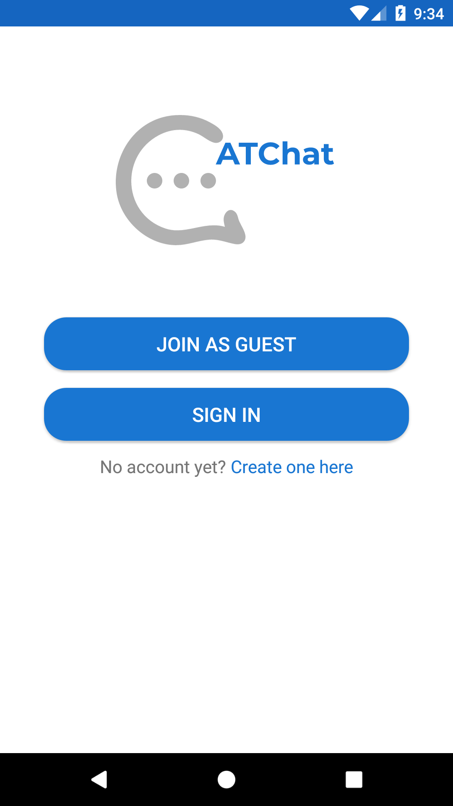

# ATChat Android
Simple chat application designed to communicate between users by sending text messages. Implemented using gRPC framework for Android devices.

## Motivation
Project is my first Android application created for getting to know the features of Android framework and practicing Java coding skills as well.

## Overview
AtChat Android application is another type of client for ATChat grpc server. Project where server and desktop client are implemented can be found [here](https://github.com/agata-tafelska/chat-grpc).

### Structure:
**1. Protofile** - file containing app's service definition
* specifies chat's models and methods for communication between client and server
* protocol buffer compiler (protoc) automatically generates data access classes in Java language out of above definition
* project uses exactly the same proto file as server - both depends on it

**2. ChatService** - uses channel specified by server address and port number to create asynchronous stub that makes calls to the server

**3. Activities** - handle inputs provided by the user and pass them to the methods called on ActivitiesCoordinator:
* MainActivity - welcome activity prompting to select preffered way of joining chat
* JoinAsGuestActivity - enables to use chat as guest
* RegisterActivity - enables to create user account
* LoginActivity - enables existing users signing in
* ChatActivity - displays entire conversation and enables to send message and follow current users; holds LiveData observers, which, once notified, immediatelly update UI with latest changes (like new messages and current users list)
  
**4. ActivitiesCoordinator** - holds an instance of ChatService that enables to send requests to the server
* coordinates switching between different activities
* holds LiveData instances observed by ChatActivity

### Screenshots

| Main chat screen | Join as guest screen | Register screen |
| --- | --- | --- |
||||

| Login screen | Chat screen | Users bottom sheet |
| --- | --- | --- |
|||